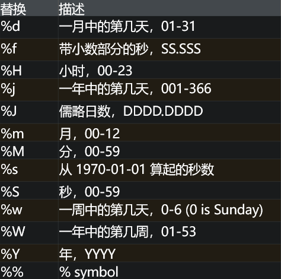
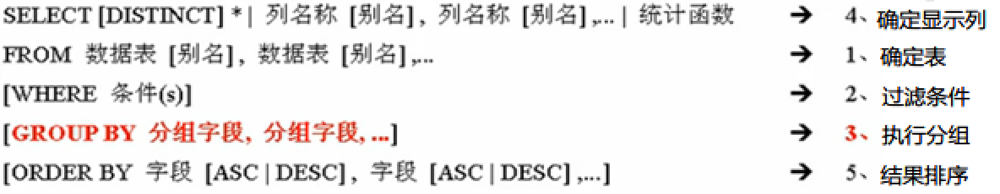
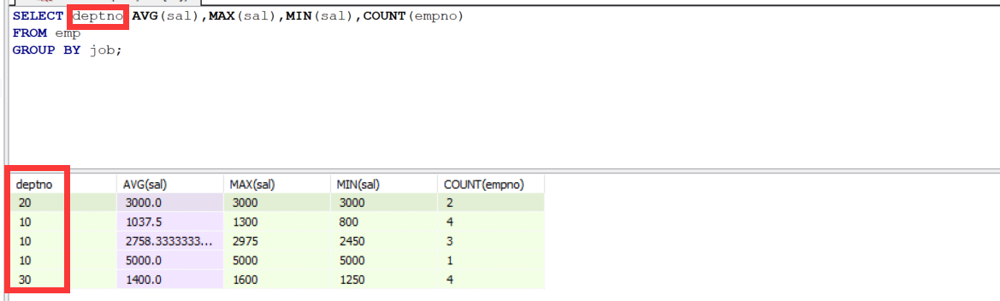
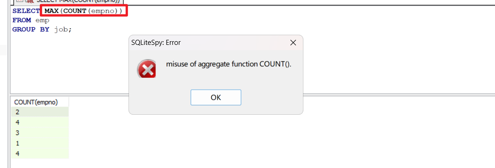
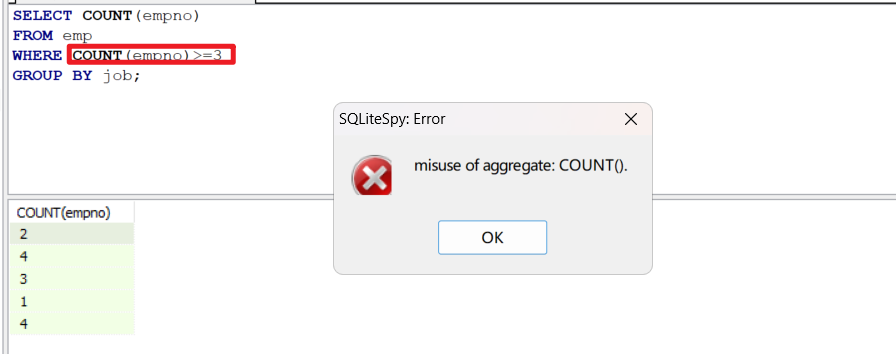
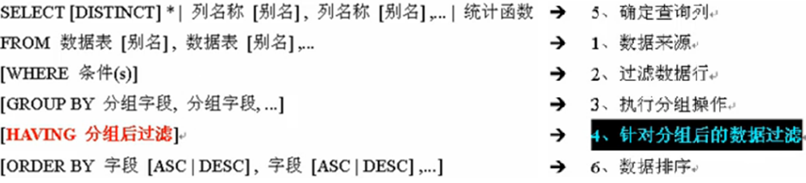
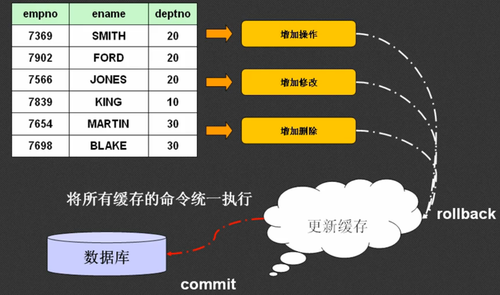
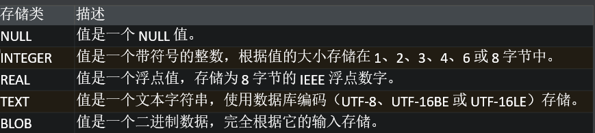
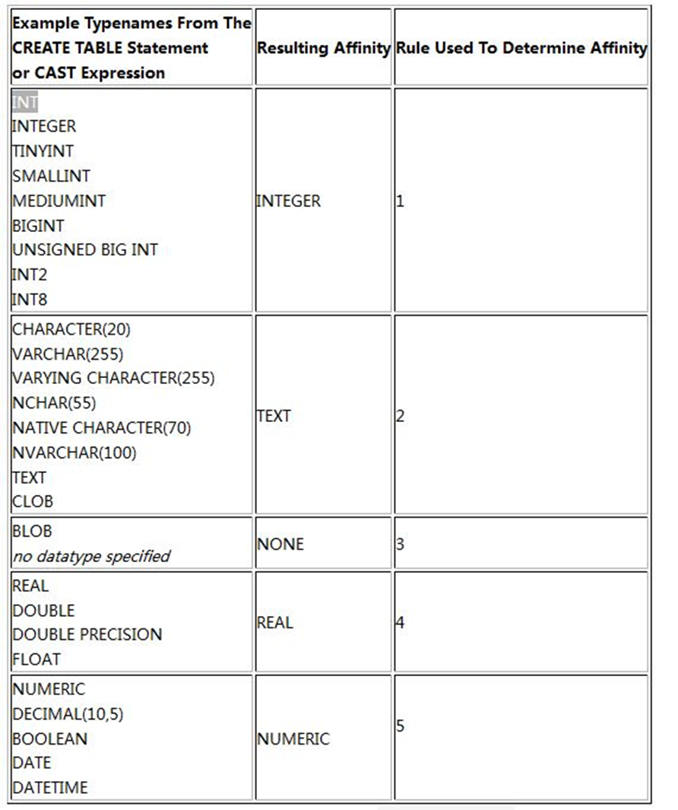

## 数据库文件

通过网盘分享的文件：scott.db

链接: https://pan.baidu.com/s/1eMQNiXJLVF8YMx6g1Z1NPA

 提取码: hqyj 

## 单表查询

select * from emp;  查询员工表的所有列  
select ename from emp; 查询员工表的ename这一列  
distinct 表示去掉重复行的数据  
<,>,>=,<=,<>,=   分别为 小于，大于，大于等于，小于等于，不等于，等于  
where 为限定查询  
select * from emp where sal >1600 ;查询所有基本工资高于1600的雇员信息  
between... and …   用于取值范围的查询，两个数是闭区间  
in(条件) 判断一个数据是否包含在若干条件中  
not in 则取反  
select * from emp where empno in(8899，1234);查询雇员编号为8899，1234的雇员信息。  
like 配合通配符进行模糊查询  _ 匹配任意一个字符  %匹配任意多个字符  
select * from emp where ename like '_A%'; 查询所有姓名以字母 开头的雇员信息  
is null 判断是否为空  is not null 判断是否不为空  
and  与操作，需要所有条件都满足  
or  或操作，所有条件满足一个  
not 取反  
order by 对结果排序  有asc 升序和desc降序两种方式  
select * from emp order by sal desc,hiredate asc; 查询所有雇员的信息，按照基本工资从高到低排序，如果基本工资相同，则按照雇佣日期从早到晚排序。  
   排序例：  
       select ename,empno,job,sal*12 income from emp order by income desc;按照年薪排序  
     年薪越高越靠前，        其中income：是 sal*12 这个计算列的别名（也叫列别名），作用是给  
     年薪临时的计算列起一个简洁、易读的名字，方便后续引用（比如排序）；   

#### 分页查询

使用limit 和 offset关键字进行分页查询，limit表示取多少结果，offset表示去掉前几条数据
分页查询公式
每页的数量 n 当前的页码m
select * from emp limit n offset (m-1)*n

 每页显示6条数据，查询第2页的内容。

SELECT * FROM emp LIMIT 3 OFFSET 12;

## 函数

#### 字符串函数

upper 字符串转大写  lower 字符串转小写

length 获取字符串的长度

substr（参1，参2，参3）截取  参1：要处理的字符串  参2：截取起点  参3：截取长度 可为空，表示截取到最后

trim  去掉字符串前后的空格

#### 数字函数

round（参1，参2） 四舍五入   参1：数字  参2：保留多少位小数 ，若为空则保留到整数位 

mod （参1，参2）  取模  参1:被除数  参2：除数   

abs   取绝对值

#### 日期函数

date time datetime     date:获取日期  time：获取时间  datetime：日期+时间

​     查询雇佣时间：select time（hiredate）from emp;

​     查询雇佣日期：select date（hiredate）from emp;

​     把'2025-01-01'转换成日期和时间格式 ：   SELECT DATETIME('2025-01-01');

​     获取当前时间数据 select datetime（'now','localtime'） 参2位时区，当前时区使用local time，默认为格林威  治时间

julianday 儒略日

​     求出每个雇员的姓名和雇佣的年数

​     -- 可以精确到天数

​     SELECT ename,(JULIANDAY('now')-JULIANDAY(hiredate))/365 FROM emp;

​     -- 默认精确到年数

​     SELECT ename,DATE('now')-hiredate FROM emp;

strftime （参1，参2） 参1：   

​                                       参2：要格式化的日期或参数

#### 空值函数

ifnull （参1，参2）参1：可能为null的数据或数据列  参2：如果null则替换的数值

注：在sql中任何数+null结果都为null

#### 统计函数

count 计数  sum 求和   avg 平均值   max 最大值  min 最小值

**【思考】COUNT(*)、COUNT(字段)、COUNT(DISTINCT 字段)的区别？**

​	count（*）： 统计查询结果的总行数

​	count（字段）：统计字段值不为null的行数

​	count（distinct 字段）：去重后再统计非null的行数


## 多表查询

#### 多表查询与内连接、外连接

例：同时统计emp和dept表的数据量

```sqlite
--外连接 SQL99
select count(*) from emp left join dept on emp.deptno=dept.deptno;
--内连接 SQL89
select count(*) from emp ,dept where emp.deptno=dept.deptno;
```

无论是外连接还是内连接都需要有消除笛卡尔积的过程，如on emp.deptno=dept.deptno和where emp.deptno=dept.deptno 

通过这两段代码的也可以发现内连接和外连接存在明显的区别：

内连接只保留两张表中匹配成功的步骤，相当于取交集，只要某条记录在其中一张表中没有匹配项就会被过滤掉

外连接以某一张表为’‘主表’‘，保留主表的所有记录，与另一张表上不匹配的字段显示null

外连接又细分为左外连接，右外连接，全外连接

注：在SQL99版本中内连接 inner join 可简写为join

| 连接类型 | 适用场景                               | 示例需求                                       |
| -------- | -------------------------------------- | ---------------------------------------------- |
| 内连接   | 只需要两张表的 “交集” 数据             | 查询 “有部门的员工” 及其所属部门               |
| 左外连接 | 需保留主表所有数据，即使另一张表无匹配 | 查询 “所有员工” 及其所属部门（含无部门的员工） |
| 右外连接 | 需保留从表所有数据，即使主表无匹配     | 查询 “所有部门” 及其下属员工（含无员工的部门） |
| 全外连接 | 需保留两张表的所有数据                 | 查询 “所有员工 + 所有部门” 的关联关系          |

#### 自连接

自连接指的是多表查询中的多张表都为同一张表

例：查询每个雇员的编号、姓名、职位和领导姓名

```sqlite
select e.empno,e.ename,e.job,m.ename from emp e left join emp m on e.mgr=m.empno; 
```

自连接关键是给同一张表取不同的别名，从而明确字段归属，避免歧义

#### 其他连接和写法

##### 交叉连接  

可以保留笛卡尔积

```sqlite
select * from emp corss join dept;
--相当于
select * from emp,dept;
```

##### 自然连接

自动找到关联字段消除笛卡尔积，这种连接方式属于内连接，且自动消除的笛卡尔积有时会不准

```sqlite
select * from emp natural join dept;
```

##### using

 可以使用using关键字制定等式关系的关联字段 ,这种方式也属于内连接

```sqlite
select * from emp join dept using(deptno);
```

#### 集合

可以把数据库查询结果看作是集合，可以进行集合的计算

##### 并集（不显示重复记录）

```sqlite
-- 查询部门20或者基本功工资大于1500的雇员信息（不显示重复记录）
select * from emp where deptno=20
union
select * from emo where sal>1500;
```

##### 并集（显示重复记录）

```sqlite
-- 查询部门20或者基本功工资大于1500的雇员信息（显示重复记录）
select * from emp where deptno=20
union all
select *from emp where sal>1500;
```

##### 交集

```sqlite
-- 查询部门20且基本工资大于1500的员工
select * from emp where deptno=20
intersect
select * from emp where sal>1500;
```

##### 差集

返回存在与第一个查询结果中但不存在于第二个查询结果中的记录

```sqlite
-- 查询部门20但基本工资不大于1500的员工
select * from emp where deptno=20
except
select * from emp where sal>1500;
```

## 分组统计

#### 分组前提

分组的前提是若干数据中存在形同的若干特征，且符合这些特征的数据量不全为1

#### 分组统计

分组统计语法格式为



例：按照职位分组，统计出每个职位的平均工资、最高工资、最低工资和人数。

```sqlite
-- 建议把分组字段加在SELECT上
-- 绝大多数分组统计SELECT子句中除了分组字段外都是统计函数
SELECT job,AVG(sal),MAX(sal),MIN(sal),COUNT(empno) FROM emp GROUP BY job ;
```

#### 分组限制

##### 限制1

非分组字段不得出现在SELECT子句中



SQLite中不会报错，但数据对应错乱

##### 限制2

SELECT子句中使用嵌套的统计函数可能会报错



##### 限制3

WHERE子句中不得使用统计函数



例：查询出每个部门的名称、人数和平均工资

```sqlite
SELECT dname,COUNT(empno),AVG(sal) FROM dept LEFT JOIN emp ON dept.deptno=emp.deptno GROUP BY dname;
```

#### 综合案例

例：统计公司每个工资等级的人数和每个等级的平均工资。

```sqlite
SELECT grade,COUNT(empno),AVG(sal) FROM salgrade LEFT JOIN emp ON emp.sal BETWEEN losal AND hisal GROUP BY grade;
```

#### 分组后筛查

使用HAVING子句完成，语法格式如下：



例：按照职位分组，统计出每个职位的平均工资，显示平均工资高于2000的职位信息。

```sqlite
SELECT job,AVG(sal) FROM emp  GROUP BY job HAVING AVG(sal) >2000;
```

**思考：WHERE 和HAVING 的区别？**

​	WHERE是在分组前使用，不能使用统计函数

​	HAVING子句必须结合GROUP BY子句一起出现，是在分组后的过滤，可以使用统计函数

例：统计出公司领取佣金和不领取佣金的人数与平均工资。

```sqlite
-- 使用UNION对两个统计结果进行拼接
SELECT '领取佣金',COUNT(empno),AVG(sal) FROM emp WHERE comm IS NOT NULL
UNION
SELECT '不领取佣金',COUNT(empno),AVG(sal) FROM emp WHERE comm IS NULL;
```

**为什么这使用UNION而不使用HAVING？**

​	这是统计两个互斥的群体，相当于：群体A：所有 `comm IS NOT NULL` 的员工    群体B：所有 `comm IS NULL` 的员工 ，这两个群体是基于同一字段（comm）的两种状态，而我们想要的结果是两个独立的统计结果，而不是按comm分组统计，所以此时可以使用UNION进行手动分组，接触HAVING的限制


## 子查询

#### 子查询

​	子查询就是在一个查询中嵌入若干个小的查询，也可以理解为查询的嵌套。子查询的出现一定伴随着（）

#### WHERE 子查询

​	WHERE的主要功能是控制数据行，在WHERE子句中可以包含**单行单列、多行多列、单行多列**的子查询：

##### 单行单列

例：统计出所有高于公司平均工资的雇员信息

```sqlite
SELECT * FROM emp WHERE sal>(SELECT AVG(sal) FROM emp);
```

例：统计出公司最早雇佣的雇员信息

```sqlite
SELECT * FROM emp WHERE hiredate=(SELECT MIN(hiredate) FROM emp);
```

###### 单行多列 

例：显示出公司雇佣最早且工资最低（条件特殊，但存在）的雇员。

```sqlite
SELECT * FROM emp 
WHERE hiredate=(SELECT MIN(hiredate) FROM emp)
AND sal=(SELECT MIN(sal) FROM emp);
```

##### 多行多列

​	相当于提供数据的范围，可以配合IN关键词使用

例：显示工资跟各个经理相同的雇员信息（包含经理本身）

```sqlite
SELECT * FROM emp WHERE sal IN (SELECT sal FROM emp WHERE job='MANAGER' );
```

#### HAVING 子查询

​	如果有HAVING子句，就一定有GROUP BY 子句

​	在HAVING子句中的子查询只能是返回单行单列的数据

例：查询出高于公司平均工资的部门编号和部门的平均工资

```sqlite
SELECT deptno，AVG(sal) 
FROM emp GROUP BY deptno HAVING AVG(sal)>(SELECT AVG(sal) FROM emp);
```

例：查询出平均工资最低的职位信息：此职位的人数与平均工资

```sqlite
-- 方法一：使用子查询
SELECT job,COUNT(empno),AVG(sal) FROM emp GROUP BY job
HAVING AVG(sal)=(
	SELECT MIN(avs)
    FROM (SELECT AVG(sal) avs FROM emp GROUP BY job)
);
```

```sqlite
-- 方法二：不使用子查询
SELECT job,COUNT(empno),AVG(sal) avs
FROM emp GROUP BY job
ORDER BY avs ASC
LIMIT 1
```

​	两种方法相比发现方法二比方法一更加简洁易懂，这个案例表示子查询不要盲目使用

#### SELECT 子查询

例：显示所有雇员的姓名、职位、部门名称和部门位置

```sqlite
-- 方法一：使用多表联查，使用关联字段消除笛卡尔积
SELECT ename,job,dname,loc FROM emp LEFT JOIN dept ON emp.deptno=dept.deptno;
```

```sqlite
-- 方法二：使用本节的内容进行SELECT子查询（不是最好的解法）
SELECT ename,job,
(SELECT dname FROM dept WHERE deptno=emp.deptno),
(SELECT loc FROM dept WHERE deptno=emp.deptno)
FROM emp;
```

#### FROM 子查询

​	FROM子句的功能是确定查询的数据来源——表，表是一种行列的集合，因此FROM子句出现的子查询结果往往是多行多列的

例：查询出每个部门的编号、名称、位置、部门人数、平均工资

```sqlite
-- 方法一：使用非子查询的方式
SELECT d.deptno,dname,loc,COUNT(empno),AVG(sal)
FROM dept d LEFT JOIN emp e ON d.deptno=e.deptno
GROUP BY d.deptno;
```

```sqlite
-- 方法二：使用FROM子查询
SELECT d.deptno,dname,loc,tem.ce,tem.avs
FROM dept d LEFT JOIN (
	SELECT deptno,COUNT(empno) ce,AVG(sal) avs
	FROM emp
    GROUP BY deptno
) tem
ON d.deptno=tem.deptno
```

​	上面的子查询在实现过程中是比较繁琐的，但是在性能上具有非常大的优势。这种优势在更大量级的数据表中会更加明显

## 数据更新操作

#### 数据更新操作

数据操作语言被称为DML，分为查询（DQL）和更新

更新操作分为：增加、修改、删除

```sqlite
-- 复制一张新的表
CREATE TABLE myemp AS SELECT * FROM emp;
```

上述语法仅仅复制的是数据库的值，约束关系不会被复制

#### 插入数据

```
-- 语法
INSTERT INTO 表名（字段...）  VALUES（值...）
```

例：在myemp表中增加数据

```sqlite
-- 使用完整方式插入(推荐)
INSERT INTO myemp(empno,ename,job,mgr,hiredate,sal,comm,deptno)
VALUES(7999,'JASON','MANAGER',7839,'1992-01-06 02:22:22',10000,NULL,40);

-- 使用简洁的方式插入
INSERT INTO myemp
VALUES(8888,'DAVID','MANAGER',NULL,DATETIME('now','localtime'),2000,1,10);
```

#### 修改数据

```sqlite
-- 语法
UPDATE 表名称 SET 字段=值,字段=值,...WHERE 更新操作 (s)
-- 如果不写WHERE，表示更新所有数据。
```

例：将公司工资最低的雇员的工资修改为公司的平均工资。

```sqlite
UPDATE myemp SET sal=(SELECT AVG(sal) FROM myemp)
WHERE sal=(SELECT MIN(sal) FROM myemp);
```

#### 删除数据

```sqlite
-- 格式
DELETE FROM 表名称 WHERE 删除条件（s）
```

例：删除公司工资最高的雇员

```sqlite
DELETE FROM myemp WHERE sal=(SELECT MAX(sal) FROM myemp);
```

以上属于物理删除，但是在开发的过程中可以把物理删除替换为逻辑删除，这样可以随时进行数据恢复。

**逻辑删除**：给数据表增加一列，例如这个列使用0表示数据已删除，使用1表示数据未删除。所有查询操作都增加一个等于1的判断。同理，删除数据就是把此列的数值从1改为0。但是逻辑删除也会造成数据冗余和性能损耗。

| 适用场景                             | 不适用场景                           |
| ------------------------------------ | :----------------------------------- |
| 数据需要频繁恢复（如草稿、临时数据） | 数据量极大、查询性能要求极高的核心表 |
| 业务需要保留操作痕迹（如审计日志）   | 有严格隐私合规要求的敏感数据         |
| 短期删除、可能复用的数据             | 唯一约束严格且高频新增的表           |

## 事务

#### 事务

分析以下应用场景，

​	甲去银行给乙汇款，执行以下步骤：

​                ● 甲往ATM机里塞钱

​                ● 甲的账户加钱

​                ● 甲的账户减钱

​                ● 乙的账户加钱

​	最后一步“乙的账户加钱”执行时出错，可能因为乙的账户冻结等问题，此时需要考虑之前的三个步骤执行还是取消。

​	如果把上面的操作在数据库操作中看做一个整体，这个整体就是事务。用户在DML的更新操作（增删改）中事务就会发挥作用。

​	事务的出现可以保证数据的完整性和一致性。

#### 相关操作

​	默认情况下，SQLite事务并非手动模式。

​	可以通过下面三个命令操作事务：

​                ● BEGIN TRANSACTION 启动事务（手动模式）

​		进入手动事务模式后，直到遇到下一个提交或回滚命令，也可以精简为BEGIN。

​                ● COMMIT 提交

​		真正把缓存区执行的操作同步到数据库中。

​                ● ROLLBACK 回滚

​		把缓存区的操作丢弃，不会影响真实数据库。



## 表的创建与管理

#### 数据定义语言 DLL

​	之前所学的所有内容都是以DML（数据操作语言）为主。在工作中，另外一个核心的概念就是DDL。DDL通常在设计和开发的初步使用，DDL可以对数据库本身进行操作。

​	对数据库中数据表的操作可以分为：CREATE 创建	DROP 删除	ALTER 修改

#### 数据类型

​	大部分数据库引擎使用严格的静态类型，值的类型由容器（存储值的列）来决定。但是SQLite使用动态类型系统，值的数据类型与本身相关，而不是它的容器。

​	以下是SQLite的存储类，存储类比数据类型更通用一些



​	每个存储类都有对应的亲和类型。



#### 创建表

​	创建表的语法结构如下

```sqlite
CREATE TABLE 表名称（
	字段	类型	[DEFAULT],
	字段	类型	[DEFAULT],
	……
	字段	类型	[DEFAULT]
	）;
--时间和日期的默认值可以使用CURRENT_TIME，CURRENT_DATE，CURRENT_TIMESTAMP，也可以直接使用固定格式的字符串。
--DEFAULT（默认值）是 SQL 中用于给数据表的列指定默认值的关键字：当你向表中插入新数据，但没有为该列显式赋值时，数据库会自动将这个默认值填充到该列中。
```

例：创建一张新表

```sqlite
CREATE TABLE member(
   mid       INTEGER,
   name      TEXT        DEFAULT      '佚名',
   birth     TEXT        DEFAULT      CURRENT_DATE,
   sex       TEXT        DEFAULT      '男',
   age       INTEGER,
   sal       REAL
);
```

#### **为表重命名**

​	如果想给一个表重新命名，可以使用下面的语法：

```sqlite
ALTER TABLE [旧表名] RENAME TO [新表名];
```

例：把member表名称改为user

```sqlite
ALTER TABLE member RENAME TO user;
```

​	需要注意，实际开发的过程中并不建议这样做，可以新建一个相同的表。

#### **删除表**

​	当某张表不再需要的时候，就可以直接进行删除操作，语法格式如下：

```sqlite
DROP TABLE 表名称;
```

例：删除一个表

```sqlite
DROP TABLE user;
```

​	在实际开发中可以考虑从应用层面直接不用某张表，而不是考虑在数据库层面删除。

#### **增加列**

​	SQLite并不支持修改列与删除列，只能通过重新建表的方式。

​	但是SQLite可以给已经存在的表增加列，语法格式如下：

```sqlite
ALTER TABLE [表名] ADD COLUMN [列名] [数据类型] [默认值]
```

例：给myemp增加性别列

```sqlite
-- 无默认值，默认值为NULL
ALTER TABLE myemp ADD COLUMN sex TEXT;

-- 设置默认值
ALTER TABLE myemp ADD COLUMN gender TEXT DEFAULT '女';
```

#### 约束

约束是在表的数据列上强制执行的规则。

约束可以限制插入到表中的数据类型，这确保数据库中数据的准确性和可靠性。

​	常见的约束类型包含：

​                ● NOT NULL

​		非空约束（简称NN或NK），确保某列不能有NULL值。

​                ● DEFAULT 

​		默认约束，当某些没有指定值时，为该列提供默认值。

​                ● UNIQUE 

​		唯一约束（简称UK），确保某列中所有的值都是不同的。

​                ● PRIMARY KEY

​			主键约束（简称PK），主键表示一个数据最重要的一列，通常都是ID之类的标识方式，需要同时		具有非空性和唯一性，在一些版本的数据库中此列默认是自增长的。

​                ● CHECK

​		条件检查约束，可以确保某些的所有值都满足一定条件。

##### 非空约束

​	默认情况下，列可以保存 NULL 值。如果您不想某列有 NULL 值，那么需要在该列上定义此约束，指定在该列上不允许 NULL 值。

​	NULL 与没有数据是不一样的，它代表着未知的数据。

例：设置非空约束

```sqlite
-- 建表语句
CREATE TABLE member(
    mid     INTEGER,
    name    TEXT     NOT NULL
);
```

##### 唯一约束

​	唯一约束指的是某个字段不允许重复。

例：设置唯一约束

```sqlite
-- 删除之前的member表
DROP TABLE member;

-- 建表语句
CREATE TABLE member(
    mid     INTEGER,
    name    TEXT      UNIQUE
);
```

##### 主键约束

​	在SQLite中，可以认为 逐渐约束≈唯一约束

​	主键作为每个记录的唯一标识，一个表中只能有一个主键（通常为第一列）。

例：设置主键约束

```sqlite
-- 删除之前的member表
DROP TABLE member;

-- 建表语句
CREATE TABLE member(
    mid     INTEGER     PRIMARY KEY,
    name    TEXT      
);
```

SQLite数据库与其他数据不同，SQLite从语法上支持NULL的插入，但是会转换成自动填充的序列。

强烈建议数据表设定主键约束。

也可以手动使用AUTOINCREMENT关键字设定主键自增长。

```sqlite
-- 删除之前的member表
DROP TABLE member;

-- 建表语句
CREATE TABLE member(
    mid     INTEGER     PRIMARY KEY    AUTOINCREMENT,
    name    TEXT      
);
```

##### 条件检查约束

​	CHECK关键字可以为某些设定一个条件，只有符合条件的数值才能被插入。

例：设置条件检查约束

```sqlite
-- 删除之前的member表
DROP TABLE member;

-- 建表语句
CREATE TABLE member(
    mid     INTEGER     PRIMARY KEY,
    name    TEXT,
    sal     CHECK(sal>1000)   
);
```

## 索引

#### 索引

索引是一种特殊的查找表，数据库索引可以加快数据检索。

​	可以把索引理解为一个指向表中数据的指针，背后通过B-Tree的树状结构取代逐行扫描，可以为WHERE子句过滤提速，同时也服务于ORDER BY、GROUP BY、JOIN ON、MIN/MAX等需要“**先找行**”的环节。

​	但是索引会降低UPDATE、INSERT、DELETE子句的执行效率。

#### 单列索引

​	单列索引是仅基于一个表的某列创建的索引，语法结构如下：

```sqlite
CREATE INDEX index_name ON table_name (column_name);
```

例：为emp表的sal列创建单列索引

```sqlite
CREATE INDEX sal_index ON emp(sal);
```

#### 唯一索引

​	唯一索引不仅用于提升性能，而且还用于数据完整性，唯一索引不允许将任何冲击重复的值插入表中，基本语法如下：

```sqlite
CREATE UNIQUE INDEX index_name ON table_name (column_name);
```

例：给emp表的ename列创建唯一索引

```sqlite
CREATE UNIQUE INDEX ename_index ON emp(ename);
```

#### 组合索引

​	组合索引是基于一个表的两个或多个列上创建的索引，基本语法如下：

```sqlite
CREATE INDEX index_name ON table_name (column_name1,column_name2,...);
```

​	如果在WHERE子句中经常有两个或多个列同时使用，可以考虑使用组合索引。

例：实际开发中，经常查询20部门的经理，请为这种场景加速

```sqlite
CREATE INDEX deptno_job_index ON emp (deptno,job);
```

```sqlite
-- 可以为下面的查询加速（包括但不限于）
SELECT * FROM emp WHERE deptno=20 AND job='MANAGER';
-- 下面的查询虽然不是部门20的经理，但是仍然可以加速
SELECT * FROM emp WHERE deptno=20 OR job='MANAGER';
```

#### 隐式索引

​	当在CREATE TABLE语句中定义了PRIMARY KEY或UNIQUE约束时，SQLite会考虑自动创建索引来保证这些约束，实际情况可能根据计算机环境、数据库版本有一定差别。

​	这些隐式索引通常不需要程序员关注，如果程序员手动需要干预索引，应该使用手动创建的方式。

例：查询数据库中所有的索引

```sqlite
SELECT * FROM sqlite_master WHERE type='index';
```

#### 强制索引

​	SQLite内部有一个查询优化器，负责决定在查询时是否使用索引以及使用哪个索引，这个过程是自动，并且是基于一系列复杂的算法来决定。

​	但是开发者可以使用INDEXED BY关键字强制使用索引，支持SELECT、DELETE和UPDATE子句。

语法格式如下：

```sqlite
SELECT|DELETE|UPDATE column1, column2...
INDEXED BY (index_name)
table_name
WHERE (CONDITION);
```

​	因为索引与SEELCT查询强相关，所以本次都以SELECT子句为例，进行强制索引的演示。通常成熟的发布版本不太考虑使用强制索引，在开发过程中，为了性能的差异对比，可以考虑使用强制索引。

例：分别使用INDEXED BY强制使用两个索引（一个有效，一个无效

```sqlite
-- 强制使用索引查询
SELECT * FROM emp INDEXED BY sal_index WHERE sal>2000;

-- 如果索引与查询不相关，则索引使用失效
SELECT * FROM emp INDEXED BY sal_index WHERE comm>800;

-- 强制使用一个不存在的索引，也会报错
SELECT * FROM emp INDEXED BY sal_index2 WHERE sal>800;
```

#### 删除索引

可以使用DROP关键字删除索引，删除索引时需要留意性能的改变，语法结构如下：

```sqlite
DROP INDEX index_name;
```

例：删除索引

```sqlite
DROP INDEX sal_index;
```

#### **什么时候需要避免使用索引**

尽管索引可以提高数据库操作的性能，但有时需要避免使用。

1. 小表

​	数据量太少（小于几千行），可能全表扫描反而更快，索引浪费空间和维护成本。

2. 写远多于读的表或列

​	频繁INSERT、UPDATE和DELETE会不断维护索引，导致性能降低。

3. 大量NULL的列

​	SQLite不对NULL建立索引，查询IS进行空判断时索引无效，白白浪费空间。

## Python操作数据库

#### **Python与数据库的关系**

​	Python是一个编程语言，本身没有数据库的功能，但是可以调用其他数据库，而SQLite是一个嵌入式数据库，非常适合本地存储轻量级数据。

​	Python内置了sqlite3模块，可以直接操作SQLite数据库，无需额外安装任何软件。

#### **连接与游标**

```sqlite
import sqlite3

# 连接SQLite数据库，参数是数据库文件名，返回一个连接对象
conn = sqlite3.connect('example.db')

# 创建一个游标对象，用于执行SQL语句
cursor = conn.cursor()
```

```sqlite
# 关闭游标
cursor.close()

# 关闭连接
conn.close()
```

#### **建表**

```sqlite
# 建表
sql = '''
CREATE TABLE IF NOT EXISTS users(
    id    INTEGER PRIMARY KEY,
    name  TEXT    NOT NULL,
    age   INTEGER
);
'''

# 让游标执行这个语句
cursor.execute(sql)
```

#### **插入数据**

​	在Python中把一些参数和SQL语法组成一个完成的SQL语句，不能通过字符串拼接的方式，因为会导致SQL注入的安全问题。

​	需要先编写含有?占位符的SQL语句，后面再传入?的参数。

```sqlite
# 插入一条记录
sql = 'INSERT INTO users(name,age) VALUES(?,?)'
name = 'Alice'
age = 30

# 参数1：含有?的SQL语句
# 参数2：参数元组，数据会替换到参数1的SQL语句中
cursor.execute(sql, (name,age))

# 使用列表批量存储多条数据参数
users = [
    ('Bob', 25),
    ('Tim', 35)
]

# 参数1：含有?的SQL语句
# 参数2：参数列表，列表中是元组，数据会替换到参数1的SQL语句中
cursor.executemany(sql, users)

# 提交事务（默认不写也行）
conn.commit()
```

#### **更新与删除**

```sqlite
# 更新：把25岁的人的姓名改为Jerry
sql = 'UPDATE users SET name=? WHERE age=?'

# 注意参数2的顺序一定与SQL语句中?的顺序相同
cursor.execute(sql, ('Jerry',25))

# 删除：删除30岁的人
sql = 'DELETE FROM users WHERE age=?'

cursor.execute(sql, (30,))

# 提交（默认可以省略）
conn.commit()
```

#### **查询数据**

```sqlite
# 查询
sql = 'SELECT * FROM users;'

# 直接执行
cursor.execute(sql)

# 拿到返回结果
rows = cursor.fetchall()

for row in rows:
    print(row)
```

```sqlite
# 查询
sql = 'SELECT * FROM users WHERE id>?;'

cursor.execute(sql, (2,))

# 拿到返回结果
rows = cursor.fetchall()

for row in rows:
    print(row)
```

